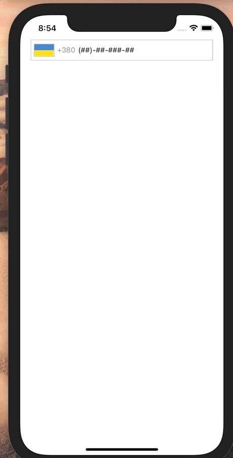

# React Native Phone Input

Phone number input field.


# React Native Phone Input With Mask

Phone number input field with supporting mask




# Installation

```sh
npm i --save @my_name_is_nero/input-phone
```


# Basic Usage
```jsx
import React from 'react';
import {View, StyleSheet} from 'react-native';
import {InputPhone, InputPhoneWithMask} from '@my_name_is_nero/input-phone';

const styles = StyleSheet.create({
  containerStyle: {
    flex:1,
  }
});

export default function App() {
  const [phoneNumber, setPhoneNumber] = React.useState({countryCode: '', phoneNumber: ''});
  const [phoheNumberWithMask, setPhoneNumberWithMask] = React.useState({countryCode: '', phoneNumber: '', phoneWithMask:""})
  
  return (
    <View style={styles.containerStyle}>
      <InputPhone value={phoneNumber} onChangeText={setPhoneNumber} />
      <InputPhone mask="(##)-##-###-##"  value={phoneNumber} onChangeText={setPhoneNumber} />
    </View>
  )
}
```


# Props
By default component support all props from TextInput (multiline always set to false). Also component have additions props like:

### Phone number input field

| Name | DefaultValue | Description | Required |
|---|---|---|---|
| placeholder | Enter phone number | Input phone number placeholder | false |
| containerStyle | | Main container style | false |
| inputContainerStyle | | Phone number input container style |false |
| inputStyle | | Phone number input value style | false |
| message | | Bottom text hint |false |
| messageStyle | | Bottom text hint style |false |
| label | | Label text |false |
| labelStyle | | Label text style |false |
| codeStyle | | Style for changing style of country code |false |
| flagContainerStyle | | Style for country image |false |

### Phone number input field with mask

| Name | DefaultValue | Description | Required |
|---|---|---|---|
| placeholder | Enter phone number | Input phone number placeholder | false |
| containerStyle | | Main container style | false |
| inputContainerStyle | | Phone number input container style |false |
| inputStyle | | Phone number input value style | false |
| message | | Bottom text hint |false |
| messageStyle | | Bottom text hint style |false |
| label | | Label text |false |
| labelStyle | | Label text style |false |
| codeStyle | | Style for changing style of country code |false |
| flagContainerStyle | | Style for country image |false |
| mask| | Mask for input field | true |

### Search query input field

| Name | Description | Default Value |
| --- | --- | --- |
| placeholderSearch | Search input placeholder | Search |
| searchInputContainerStyle | Search field container style | |
| searchInputStyle | Search field value style | |

### Country list
| Name | Description | 
| --- | --- |
| listContainerStyle | Main container style for country list | 
| listStyle | Container style for country list | 
| listContentContainerStyle | Container style for country list | 
| itemContainerStyle | Container item style inside country list | 
| itemStyle | Value style inside country list | 
| itemCodeStyle | Code style inside country list |
  
  
